# Forensic Analysis Report

## 📌 Project Description
This project documents a digital forensic analysis conducted on a suspect USB storage device to identify, analyze, and report on potentially malicious artifacts and activity. The investigation focuses on file system examination, metadata analysis, and validation of suspicious files extracted from the removable media using industry-standard forensic tools and methodologies.

The goal of this report is to present findings in a clear, structured, and reproducible manner, suitable for academic, professional, or legal review.

---

## 🛠 Technologies & Software Used
- **Virtualization & Operating Systems**
  - **Kali Linux (Prebuilt VirtualBox Image)** – 64-bit, Version 2025.3
  - **Oracle VirtualBox** – Version 7.2.2  
  - **Windows 10 Pro (Virtual Machine)** – Version 1903, OS Build 18362.356
    
- **Programming Languages & Runtimes** 
  - **Java** – Version 17.0.8
  - **Python** – Version 3.13.9
 
- **Digital Forensic & Analysis Tools**
  - **Autopsy** – Version 4.21.0
  - **Exterro FTK Imager** – Version 8.2.0.26
  - **TestDisk & PhotoRec (CGSecurity)** – Version 7.3

- **PDF & File Analysis Tools**
  - **Didier Stevens PDF Tools**
    - `pdf-parser.py` – Version 0.7.13  
    - `pdfid.py` – Version 0.2.10

- **Steganography Analysis Tools**
  - **StegSeek** – Version 0.6  
  - **zSteg** – Version 0.2.13 

- **Utilities**
  - Git & GitHub (Upload report documentation to Github repo)
  - Hashing utilities (MD5, SHA-256)

---

## 🧪 Exhibit

### Exhibit A: Picture of USB device
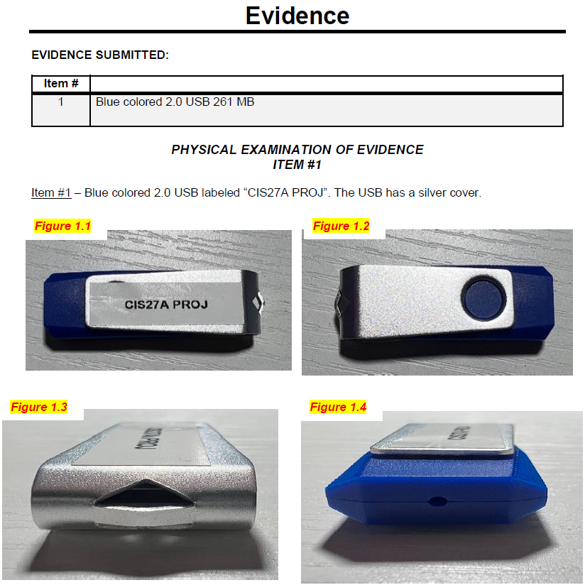

**Description:**  
This exhibit shows the physical examination of the USB storage device.

---

### Exhibit B: USB Hashes
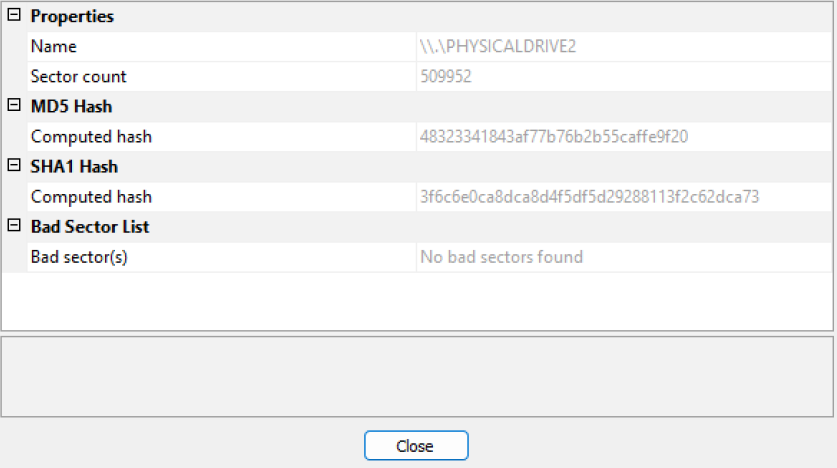

**Description:**  
This exhibit shows the hashes (MD5 and SHA1) of the USB device calculated by Exterro FTK Imager for file integrity.

---

### Exhibit C: USB Device Raw Image File Verification
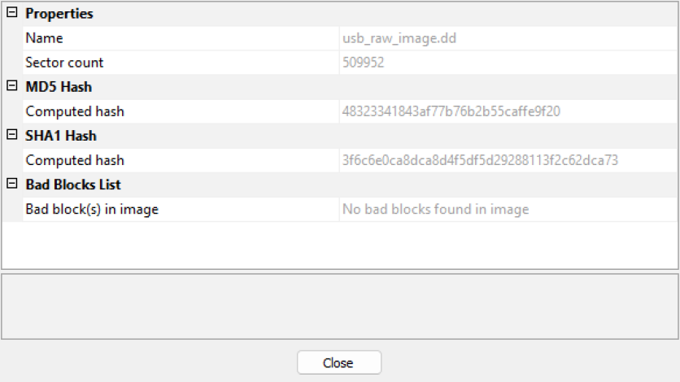

**Description:**  
This exhibit shows the hashes (MD5 and SHA1) of the raw image file (.dd) created by Exterro FTK Imager from the USB storage device.

---

### Exhibit D: Autopsy Analysis Report
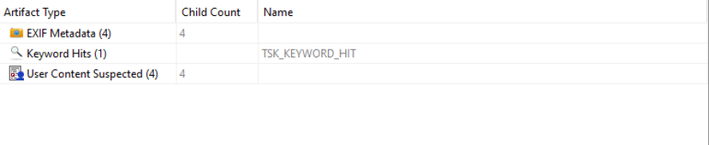

**Description:**  
This exhibit shows an Analysis Report created by Autopsy. It shows what artifacts should be looked into.

---

### Exhibit E: User Content Suspected by Autopsy


**Description:**  
This exhibit shows User Content Suspected by Autopsy. It flags artifacts that were created by a user and should be investigated further.

---

### Exhibit F: Email Found by Autopsy
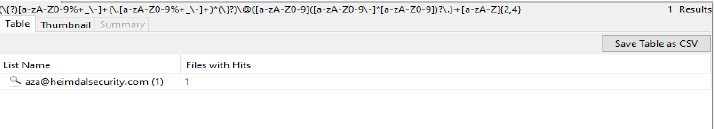

**Description:**  
This exhibit shows emails found by Autopsy. Only one email was found.

---

### Exhibit G: Suspicious Item Flagged by Autopsy
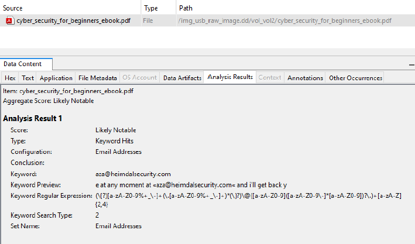

**Description:**  
This exhibit shows Suspicious Items flagged by Autopsy. It shows items that may contain information worth investigating.

---

### Exhibit H: File Carving Deleted or Hidden Files via Photorec
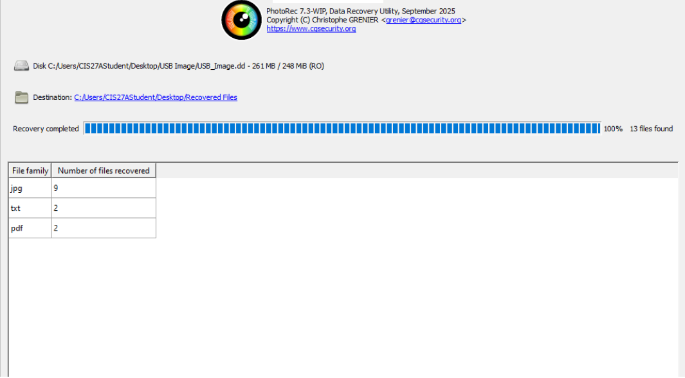

**Description:**  
This exhibit shows qphotorec recovering deleted or hidden files from the USB device image.

---

### Exhibit I: Using PDF-ID to Find Suspicious Embedded Content in PDF
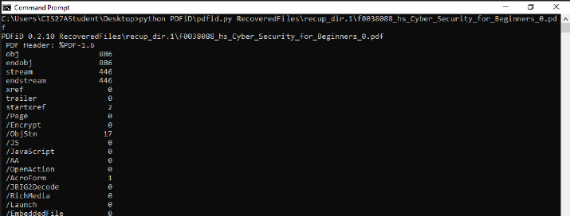

**Description:**  
This exhibit shows how to run PDF-ID to list the embedded elements in a PDF. PDFs may contain suspicious elements, such as embedded JavaScript or automatic actions, which can carry out malicious activity.

---

### Exhibit J: Locating AcroForm Element Embedded in PDF via PDF-Parser
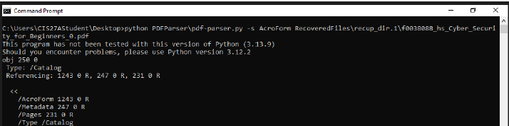

**Description:**  
This exhibit shows how to locate AcroForm elements embedded in PDFs with PDF-Parser. AcroForm elements are worth investigating because they are a PDF form technology that allows interactive fields such as text inputs, buttons, and scripts within a document, which can be used to carry out malicious activity.

---

### Exhibit K: Inspecting AcroForm Element Embedded in PDF via PDF-Parser


**Description:**  
This exhibit shows how to inspect AcroForm elements with PDF-Parser.

---

### Exhibit L: Locating Embedded JavaScript in PDF via PDF-Parser
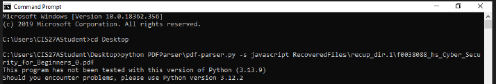

**Description:**  
This exhibit shows how to located embedded JavaScript in PDFs using PDF-Parser.

---

### Exhibit M: Extracting Embedded URIs via PDF-Parser
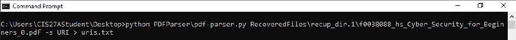

**Description:**  
This exhibit shows how to extract embedded URIs using PDF-Parser. URIs are worth investigating because they can link or redirect a PDF viewer to an external website, which may host malicious content or be used for phishing or exploitation.

---

### Exhibit N: StegSeek Script Used for JPGs
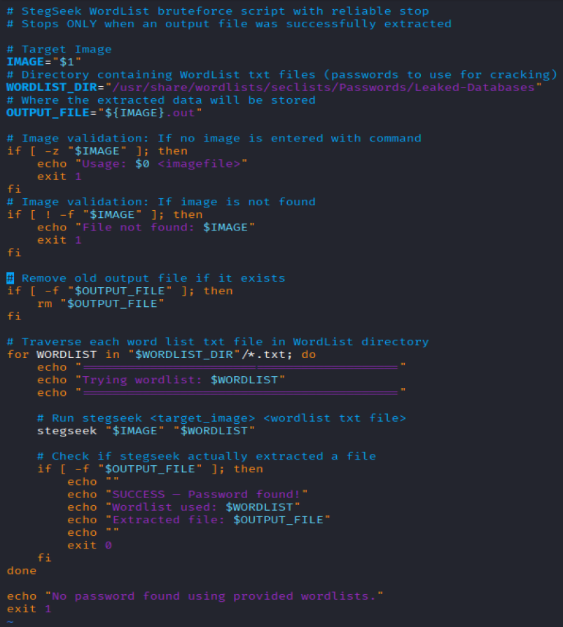

**Description:**  
This exhibit shows a script developed to perform password cracking on steganography-protected files and to extract embedded data when the cracking process was successful. StegSeek was utilized exclusively for JPEG files, as the tool does not support steganographic analysis of PNG files.

---

### Exhibit O: Cracking Steganography Password and Extracting Embedded Data in JPG
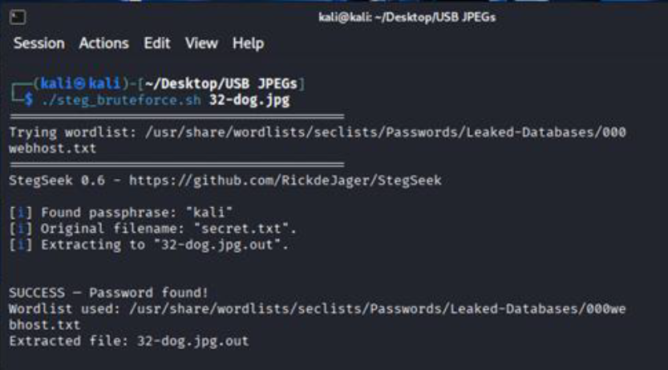

**Description:**  
This exhibit shows the StegSeek script being successful when executed on the dog.jpg file. The password and embedded filename are displayed, as well as the output file for the extracted data.

---

### Exhibit P: Looking at Extracted Data Content in JPG


**Description:**  
This exhibit shows the content of the embedded file (secret.txt).

---

### Exhibit Q: zSteg Script Used for PNGs
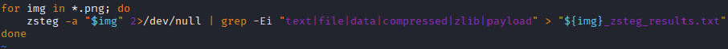

**Description:**  
This exhibit shows the zSteg script used to analyze PNG files for embedded data and extract potential hidden file types. The accompanying results.txt files document the various embedded data formats identified within each PNG image. zSteg was utilized exclusively for PNG analysis, as the tool does not support steganographic analysis of JPEG files.

---

### Exhibit R: How to Grep for zSteg Results Created by Script in Exhibit Q


**Description:**  
This exhibit the use of a grep command to filter and isolate relevant results generated by the zSteg analysis script. The command was used to identify indicators of potentially malicious embedded content by searching for keywords commonly associated with hidden or compressed data.

```bash
grep -Ei "text|file|data|compressed|zlib|payload" <filename>_results.txt
```

This filtering approach allowed the investigation to focus specifically on entries suggesting embedded payloads or non-image data within the analyzed PNG files, reducing noise and improving analysis efficiency.

---

### Exhibit S: Embedded File Found in PNG: Terse Exectuable (TE)
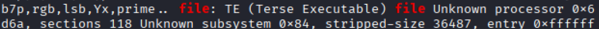

**Description:**  
This exhibit shows a Terse Executable found in a PNG by zSteg. Terse executables embedded within PNG files are worth investigating because they indicate potential file masquerading or steganographic concealment, a common technique used to hide malicious payloads. PNG files are expected to contain only image data; the presence of executable content suggests intentional obfuscation designed to evade detection. Such embedded executables may be extracted and executed after delivery, posing a security risk, and can provide critical evidence of malicious intent or unauthorized data concealment during a forensic investigation.

---

### Exhibit T: Embedded File Found in PNG: PGP Encrypted Data


**Description:**  
This exhibit shows a PGP-Encrypted Data file found in a PNG by zSteg. PGP-encrypted data embedded within PNG files is worth investigating because it indicates intentional concealment of protected information within a file type not intended to store encrypted payloads. The use of strong encryption suggests an effort to prevent content inspection, which may be associated with data exfiltration, covert communications, or the hiding of illicit material. In a forensic investigation, such findings can point to deliberate obfuscation and warrant further analysis to determine the data’s origin, purpose, and potential misuse.

---

### Exhibit U: Embedded File Found in PNG: PDP-11 Pure Executable


**Description:**  
This exhibit shows a PDP-11 Pure Executable found in a PNG by zSteg. A PDP-11 Pure Executable embedded within a PNG file is worth investigating because it represents executable code concealed inside a non-executable image format, which strongly suggests intentional obfuscation. PNG files are not designed to contain runnable binaries, and the presence of a legacy executable format indicates file masquerading or steganographic techniques used to evade detection. In a forensic investigation, such an artifact may point to hidden payload delivery, experimentation with unconventional malware techniques, or attempts to conceal executable content, making it a significant indicator of suspicious or malicious activity.

---

## 👤 Author(s)
- **Christian Ruiz**  
  Digital Forensics Student  
  GitHub: https://github.com/cr-droid
